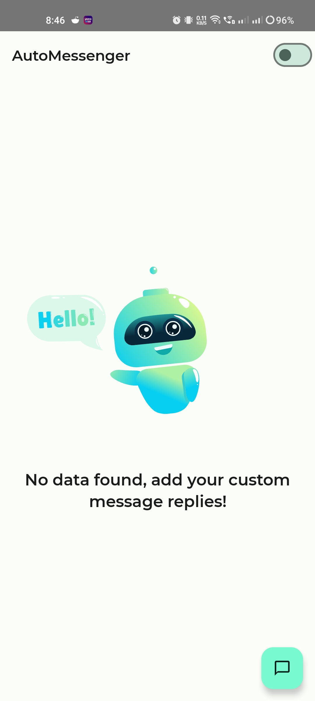
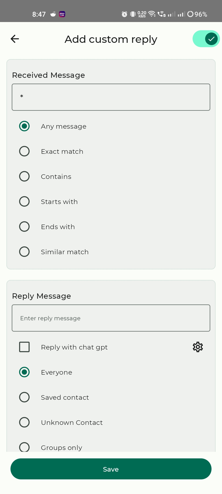
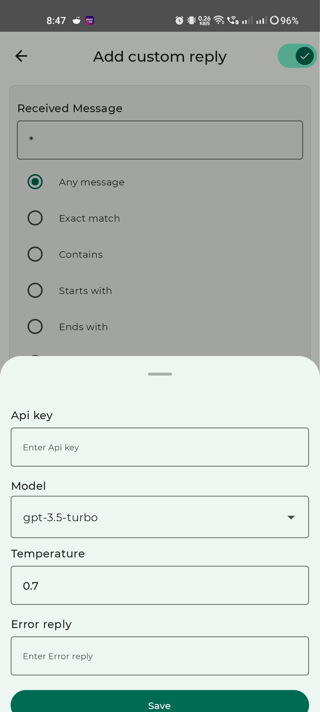

# AutoMessenger Android Application

AutoMessenger is an Android application designed to simplify the process of sending auto replies to messages. With AutoMessenger, users can set up custom auto-reply messages for various messaging platforms such as WhatsApp. This auto message sender app seamlessly integrates with OpenAI for intelligent auto-responses, making it a top choice for users looking for a reliable auto message sender. 

## Features

- **Custom Auto Replies:** Users can easily set up custom auto-reply messages for different messaging platforms such as SMS, WhatsApp, Messenger, etc.
- **OpenAI Integration:** Integration with OpenAI allows for intelligent auto-responses based on the received messages.
- **Easy Configuration:** Simple and intuitive interface for configuring auto-reply settings.
- **Personalization:** Users can customize auto-reply messages according to their preferences.
- **Automation:** Messages are replied to automatically, saving users time and effort.

## Usage

1. Launch the AutoMessenger application on your Android device.
2. Navigate to the settings section.
3. Configure the auto-reply settings according to your preferences.
4. Enable the OpenAI integration if desired.
5. Start receiving messages, and watch as AutoMessenger sends auto-replies seamlessly.

## OpenAI Integration

AutoMessenger integrates with OpenAI to provide intelligent auto-responses. Follow the steps below to obtain an API key for OpenAI:

1. **Sign Up/Login:** Visit the [OpenAI website](https://openai.com/) and sign up for an account. If you already have an account, simply log in.

2. **Navigate to API Section:** Once logged in, navigate to the API section of your account dashboard.

3. **Generate API Key:** In the API section, you'll find an option to generate an API key. Click on it and follow the instructions to generate your unique API key.

4. **Copy API Key:** Once generated, copy your API key to your clipboard.

5. **Enter API Key in AutoMessenger:** Launch the AutoMessenger application on your Android device, navigate to the settings section, and find the option to enter your OpenAI API key. Paste the copied API key into the designated field.

## Media

### Screenshots

  
   
   

### Demo Video

[Watch Demo Video](https://github.com/sachincvn/AutoMessageReplier/blob/master/media/video_demo.mp4)

## Contributing

Contributions are welcome! If you have any suggestions, bug reports, or feature requests, please open an issue on the GitHub repository. If you'd like to contribute code, please fork the repository and submit a pull request.

---

**Note:** AutoMessenger is a fictitious project created for demonstration purposes.
